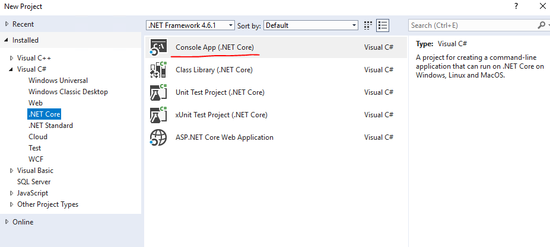
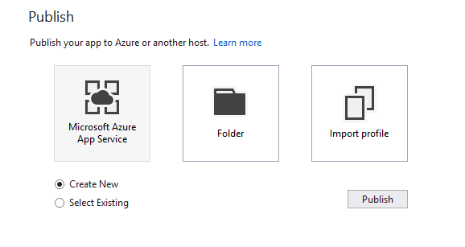

## Walkthrough Steps

Note: Azure workload is necessary for this walkthrough.

1.File > New > Project > C#/VB > .NET Core> Console App(.NET Core).



2.Build the project.

3.Publish the console app to Microsoft Azure App Service (Create new/Select Existing)



4.Check the webJobs in Server Explorer, your console app is under On Demand& Scheduled folder.


5.When publish completed, Settings.job file will be added to the console app. It tests how often do you need to run this webJob.


6.Uncomment a schedule and publish the console app again


7.Navigate to http://yourwebjobsapp.[**scm**].azurewebsites.net/  >Tools>WebJob Dashboard.
Open your console app  to check the frequency of webJob.


8.Change a triggered webjob to continuous, you can update the pubxml property in the pubxml. (Note: In 15.4 prev3, there will be a settings dialog where you will be able to change this.)

```
<WebJobType>Continuous</WebJobType>
```

9.Then do publish again. Refresh your webjob app in Server Explorer, your console app will show in Continuous folder.

